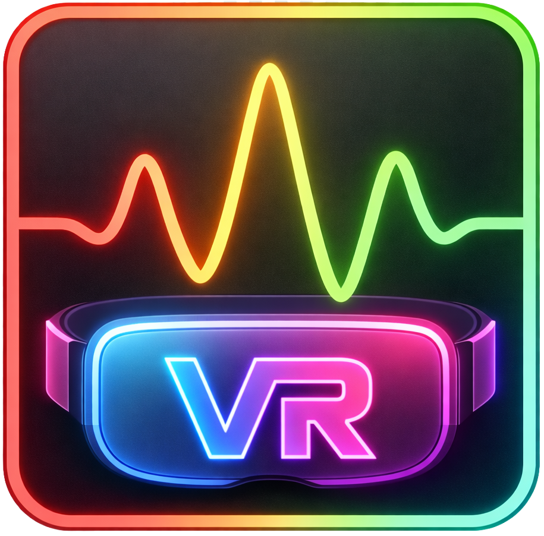

# PitchBrick


### [**PitchBrick**](https://crates.io/crates/pitchbrick) is a tiny always-on-top window that watches your voice pitch in real time and tells you **at a glance** whether you're hitting your target range.

When you're practicing a feminine or masculine voice, it's easy to drift without noticing. **Especially in VR and games** You're already concentrating on resonance, breath, inflection, and everything else at once. PitchBrick takes pitch off your mental checklist. It sits in the corner of your screen  **over games, Discord calls, whatever** and shows you a single color: **green** when your pitch is in range, **red** when you've drifted out, **black** when it can't hear you.

No graphs to read. No numbers to remember. Just a color you can glance at mid-conversation.

It comes setup to use a classic feminine range (165-255 Hz), a masculine range (85-180 Hz), or dial in your own custom target. If you stay in the red zone for too long, an optional reminder tone plays so you catch yourself without having to watch the screen constantly. Everything is configurable and takes effect instantly.

It won't teach you how to change your voice. But once you're working on pitch, it keeps you honest.

## VRChat specific guidance
### PitchBrick is a proper SteamVR Startup overlay too! It shows up on the corner of your vision automatically when starting SteamVR. So you can have a clean little reminder where you are. You can mute yourself in VR and do a quick vocal check without leaving VR. Plus get great feedback on how you are doing, **even when busy doing other things.**

## Features

- **Real-time pitch detection** via FFT analysis of microphone input
- **Color-coded feedback**  green (in range), red (out of range), black (silence/no voice)
- **Smooth 1-second color transitions** between states
- **Configurable gender target**  switch between feminine (165–255 Hz) and masculine (85–180 Hz) ranges
- **Reminder tone**  plays after a configurable duration in the red zone
- **Always-on-top borderless window**  stays visible over games, VRChat, Discord, etc.
- **Draggable window**  click anywhere on the canvas to reposition
- **Hot-reloadable config**  edit `~/pitchbrick.toml` and changes apply instantly
- **Device selection**  pick your microphone and speaker from the tray icon menu
- **Window position/size persistence**  remembers where you left it
- **SteamVR overlay**  color indicator visible in VR headsets, with smooth color fading
- **VR-specific settings**  separate frequency ranges, reminder settings, and audio devices for VR mode

## Installation

### 1. Install Rust (if you don't have it)

Download and run **rustup-init.exe** from [rustup.rs](https://rustup.rs), then follow the prompts. This installs `cargo`, the Rust package manager.

### 2. Install PitchBrick

1. Press **Win + R**, type:
```
cargo install pitchbrick
```

The binary is placed in `%USERPROFILE%\.cargo\bin\pitchbrick.exe`, which is added to your PATH by rustup automatically.

### 3. Add to the Start Menu (optional)

1. Press **Win + R**, type `%USERPROFILE%\.cargo\bin` and press Enter — this opens the folder containing `pitchbrick.exe`
2. Right-click `pitchbrick.exe` and choose **Create shortcut**
3. Press **Win + R**, type `shell:programs` and press Enter — this opens your Start Menu programs folder
4. Move the shortcut you just created into that folder

PitchBrick will now appear in the Start Menu.

## Usage

```
pitchbrick [OPTIONS]

Options:
  -v, --verbose  Enable verbose logging to ~/pitchbrick-verbose.log
  -h, --help     Print help
```

On first launch, PitchBrick creates a default config at `~/pitchbrick.toml` and opens a small always-on-top window. Right-click the tray icon to:

- Toggle target gender (Female/Male)
- Open the config file in Notepad
- Toggle SteamVR overlay on/off
- Allow VR-specific settings (visible when overlay is enabled)
- Select input/output audio devices

## Configuration

PitchBrick stores its config at `~/pitchbrick.toml`. The file is hot-reloaded  edits take effect within ~500ms.

```toml
target_gender = "female"       # "female" or "male"
female_freq_low = 165.0        # Hz  lower bound of feminine range
female_freq_high = 255.0       # Hz  upper bound of feminine range
male_freq_low = 85.0           # Hz  lower bound of masculine range
male_freq_high = 180.0         # Hz  upper bound of masculine range
red_duration_seconds = 3.0     # Seconds in red before reminder tone plays
reminder_tone_freq = 200.0     # Hz  reminder tone pitch (100–4000)
reminder_tone_volume = 0.3     # 0.0–1.0
input_device_name = ""         # Empty string = system default
output_device_name = ""        # Empty string = system default
vr_overlay_enabled = true      # SteamVR overlay on/off
vr_specific_settings = false   # Use separate VR settings when overlay is active
```

Overlapping frequency ranges are automatically corrected on load.



### SteamVR Overlay

When `vr_overlay_enabled` is true, PitchBrick displays a small color indicator in your VR headset that mirrors the desktop display with smooth color fading. The overlay registers itself as a SteamVR startup app so it launches automatically with SteamVR.

### VR-Specific Settings

Enable "Allow VR Specific Settings" from the tray menu (or set `vr_specific_settings = true`) to use separate configuration for VR mode. On first enable, a `[vr]` section is created in your config by copying the current desktop values. VR mode activates when both the overlay and VR-specific settings are enabled.

When VR mode is active, the tray icon changes to a purple VR indicator and a balloon notification appears. Toggling the overlay off deactivates VR mode and restores the desktop tray icon.

```toml
[vr]
target_gender = "female"
female_freq_low = 165.0
female_freq_high = 255.0
male_freq_low = 85.0
male_freq_high = 155.0
red_duration_seconds = 0.5
reminder_tone_freq = 165.0
reminder_tone_volume = 0.5
input_device_name = ""
output_device_name = ""
# vr_x = 400          # Overlay X position (pixel-like units)
# vr_y = 200          # Overlay Y position (pixel-like units)
# vr_width = 86.0     # Overlay width (pixel-like units)
# vr_height = 86.0    # Overlay height (pixel-like units)
```

## How It Works

PitchBrick captures audio from your microphone, runs FFT-based pitch detection at ~60 fps, and maps the detected fundamental frequency (F0) to a display state:

| Detected F0       | State  | Color |
|--------------------|--------|-------|
| In target range    | Green  | Solid green (0, 204, 0) |
| 65–300 Hz but out of range | Red | Solid red (204, 0, 0) |
| Outside 65–300 Hz or silence | Black | Solid black |

If the display stays red for longer than `red_duration_seconds`, a sine-wave reminder tone plays through your selected output device until your pitch returns to range.

## Platform

Windows (uses WASAPI shared mode for audio, Win32 for screen metrics). A non-Windows fallback assumes 1920x1080 for window sizing.

## Support 🏳️‍⚧️

If PitchBrick is useful to you, consider supporting development on [Patreon](https://www.patreon.com/cw/lexi_bytes).

## License

Apache-2.0
