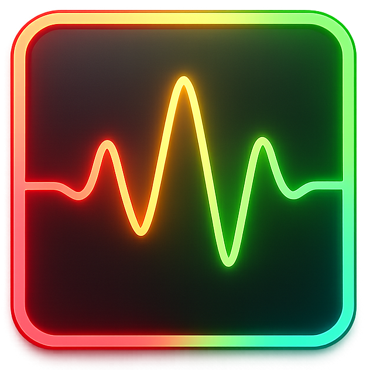

# PitchBrick



A real-time vocal pitch monitor for transgender voice training. PitchBrick displays a simple color indicator  green when your pitch is in your target range, red when it drifts out, and black when no voice is detected. An optional reminder tone plays after sustained out-of-range pitch to help build awareness.

## Features

- **Real-time pitch detection** via FFT analysis of microphone input
- **Color-coded feedback**  green (in range), red (out of range), black (silence/no voice)
- **Smooth 1-second color transitions** between states
- **Configurable gender target**  switch between feminine (165–255 Hz) and masculine (85–180 Hz) ranges
- **Reminder tone**  plays after a configurable duration in the red zone
- **Always-on-top borderless window**  stays visible over games, VRChat, Discord, etc.
- **Draggable window**  click anywhere on the canvas to reposition
- **Hot-reloadable config**  edit `~/pitchbrick.toml` and changes apply instantly
- **Device selection**  pick your microphone and speaker from the menu bar
- **Window position/size persistence**  remembers where you left it

## Installation

### 1. Install Rust (if you don't have it)

Download and run **rustup-init.exe** from [rustup.rs](https://rustup.rs), then follow the prompts. This installs `cargo`, the Rust package manager.

### 2. Install PitchBrick

1. Press **Win + R**, type:
```
cargo install pitchbrick
```

The binary is placed in `%USERPROFILE%\.cargo\bin\pitchbrick.exe`, which is added to your PATH by rustup automatically.

### 3. Add to the Start Menu (optional)

1. Press **Win + R**, type `%USERPROFILE%\.cargo\bin` and press Enter — this opens the folder containing `pitchbrick.exe`
2. Right-click `pitchbrick.exe` and choose **Create shortcut**
3. Press **Win + R**, type `shell:programs` and press Enter — this opens your Start Menu programs folder
4. Move the shortcut you just created into that folder

PitchBrick will now appear in the Start Menu.

## Usage

```
pitchbrick [OPTIONS]

Options:
  -v, --verbose  Enable verbose logging to ~/pitchbrick-verbose.log
  -h, --help     Print help
```

On first launch, PitchBrick creates a default config at `~/pitchbrick.toml` and opens a small always-on-top window. Use the menu bar at the top to:

- Toggle target gender (Female/Male)
- Open the config file in Notepad
- Adjust reminder tone frequency and volume
- Select input/output audio devices

## Configuration

PitchBrick stores its config at `~/pitchbrick.toml`. The file is hot-reloaded  edits take effect within ~500ms.

```toml
target_gender = "female"       # "female" or "male"
female_freq_low = 165.0        # Hz  lower bound of feminine range
female_freq_high = 255.0       # Hz  upper bound of feminine range
male_freq_low = 85.0           # Hz  lower bound of masculine range
male_freq_high = 180.0         # Hz  upper bound of masculine range
red_duration_seconds = 3.0     # Seconds in red before reminder tone plays
reminder_tone_freq = 200.0     # Hz  reminder tone pitch (100–4000)
reminder_tone_volume = 0.3     # 0.0–1.0
input_device_name = ""         # Empty string = system default
output_device_name = ""        # Empty string = system default
```

Overlapping frequency ranges are automatically corrected on load.

## How It Works

PitchBrick captures audio from your microphone, runs FFT-based pitch detection at ~60 fps, and maps the detected fundamental frequency (F0) to a display state:

| Detected F0       | State  | Color |
|--------------------|--------|-------|
| In target range    | Green  | Solid green (0, 204, 0) |
| 65–300 Hz but out of range | Red | Solid red (204, 0, 0) |
| Outside 65–300 Hz or silence | Black | Solid black |

If the display stays red for longer than `red_duration_seconds`, a sine-wave reminder tone plays through your selected output device until your pitch returns to range.

## Platform

Windows (uses WASAPI shared mode for audio, Win32 for screen metrics). A non-Windows fallback assumes 1920x1080 for window sizing.

## License

Apache-2.0
